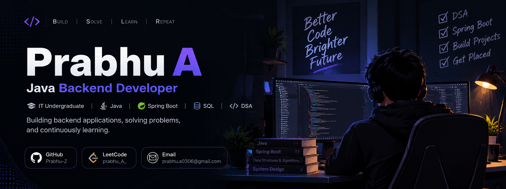

  

<h1 align="center">Hi 👋, I'm Prabhu A</h1>

  <b>Java Backend Developer | Spring Boot | SQL | DSA</b>

---

## 👨‍💻 About Me

I'm an Information Technology undergraduate focused on Java backend development, problem solving, and building practical applications.

Currently, I'm strengthening my skills in Java, Spring Boot, SQL, REST APIs, JPA/Hibernate, and Data Structures & Algorithms.

I enjoy learning by building projects, debugging real problems, and continuously improving my understanding of backend development.

- ☕ Focused on Java & Backend Development
- 🌱 Currently learning Spring Boot & Backend Architecture
- 🧠 Practicing Data Structures & Algorithms
- 🗄️ Working with SQL, JPA & Hibernate
- 🔧 Building REST APIs
- 🎯 Goal: Become a strong Java Backend Developer

---

## 🛠️ Tech Stack

| Category | Technologies |
|----------|--------------|
| **Languages** | Java, C, Python |
| **Backend** | Spring Boot, REST APIs, JPA, Hibernate |
| **Database** | MySQL, SQL |
| **Frontend** | HTML, CSS, JavaScript |
| **Tools** | Git, GitHub, IntelliJ IDEA, VS Code |

---

## 🚀 Featured Projects

### 🏫 Community Management System

**Java | Spring Boot | SQL**

A backend application designed to manage community-related information and activities.

- Developed backend functionality using Spring Boot
- Designed REST APIs
- Used SQL for persistent data storage
- Applied layered backend architecture

### 🎓 Student Management System

**Java | Spring Boot | JPA | MySQL**

A CRUD-based backend application for managing student information.

- Implemented CRUD operations
- Built REST endpoints
- Used JPA/Hibernate
- Connected the application with MySQL

---

## 🧠 Data Structures & Algorithms

I regularly practice Data Structures and Algorithms using Java to improve my problem-solving skills and prepare for technical interviews.

**Topics I'm practicing:**

- Arrays & Strings
- HashMap & HashSet
- Linked Lists
- Stack & Queue
- Recursion
- Sorting & Searching
- Sliding Window
- Prefix Sum
- Trees
- Graphs
- Dynamic Programming

🔗 [LeetCode](https://leetcode.com/prabhu_A_/)

---

## 📚 Currently Learning

| Area | Focus |
|------|-------|
| ☕ Java | OOP, Collections, Exception Handling |
| 🚀 Spring Boot | REST APIs, MVC, Dependency Injection |
| 🗄️ Database | SQL, MySQL, JPA/Hibernate |
| 🧠 DSA | Problem Solving & Algorithms |
| 🔐 Backend | Authentication, Authorization & API Design |
| 🧪 Development | Git, Testing & Debugging |

---

## 🎯 Current Goals

- ✓ Strengthen Java fundamentals
- ✓ Improve DSA & problem solving
- → Build production-style Spring Boot applications
- → Learn Spring Security & JWT
- → Build stronger backend projects
- → Explore AI integration with Java/Spring Boot
- → Learn cloud fundamentals

---

## 🤝 Let's Connect

📧 **prabhu.a0306@gmail.com**

🔗 **GitHub:** [Prabhu-Z](https://github.com/Prabhu-Z)

🔗 **LeetCode:** [prabhu_A_](https://leetcode.com/prabhu_A_/)

---

  Building consistently. Learning continuously. Improving every day. 🚀

